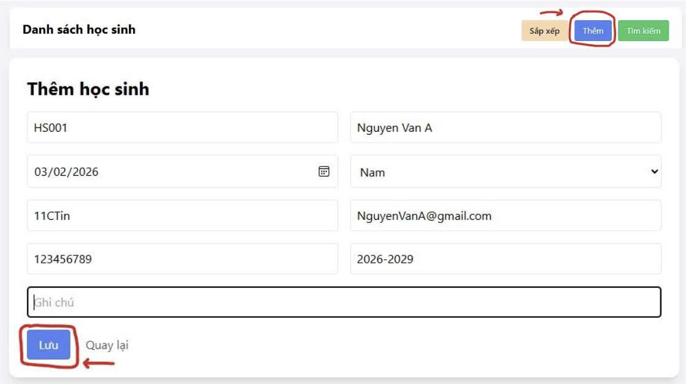
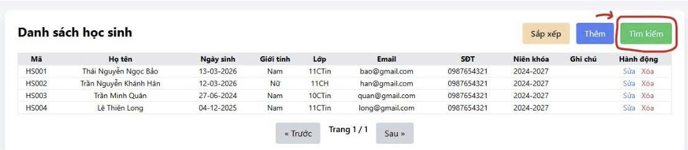
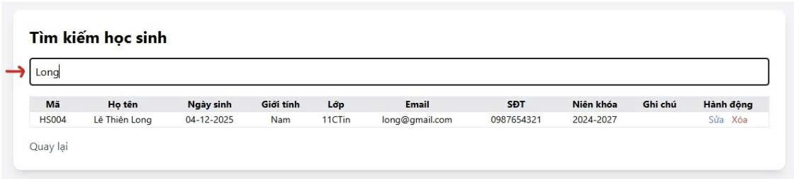
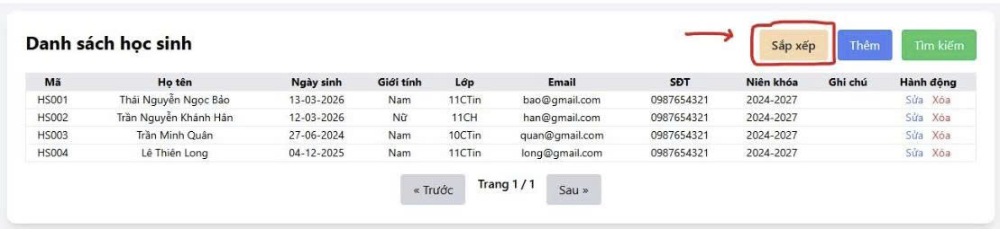
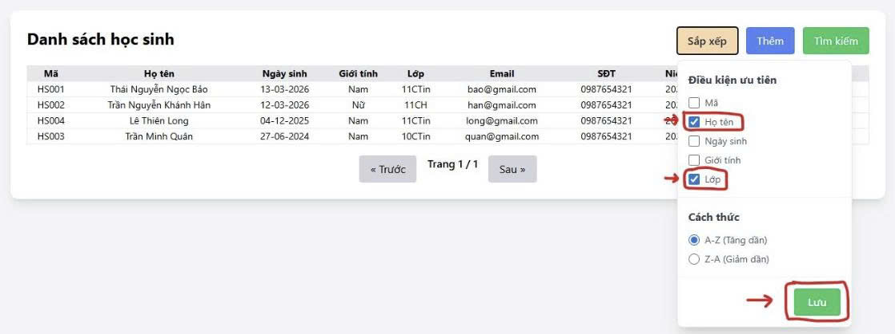
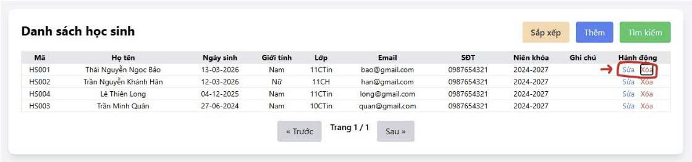

# CHỦ ĐỀ: TRANG WEB NHẬP, SỬA VÀ TÌM KIẾM DỮ LIỆU 

**PHIÊN BẢN:** DÀNH CHO QUẢN LÍ HỌC SINH SINH VIÊN 

## NHÓM THỰC HIỆN 
1. THÁI NGUYỄN NGỌC BẢO - 01 
2. TRẦN NGUYỄN KHÁNH HÂN - 08 
3. LÊ THIÊN LONG - 14 

---

## 1. Giới thiệu sản phẩm 

### 1.1 Tên sản phẩm 
**Website Quản Lý Dữ Liệu Sử Dụng SQL Để Quản Lí Danh Sách Học Sinh Sinh Viên** 

### 1.2 Mô tả sản phẩm 
Trong thời đại công nghệ thông tin hiện nay, việc lưu trữ và quản lý dữ liệu một cách hiệu quả là rất quan trọng. Nhằm giúp người dùng có thể dễ dàng quản lý dữ liệu, nhóm đã xây dựng một website quản lý dữ liệu đơn giản có liên kết với cơ sở dữ liệu SQL. Thích hợp sử dụng cho môi trường học tập hay quản lí học sinh, giúp nâng cao hiệu quả quản lí và công việc.

Website cho phép người dùng thực hiện các thao tác cơ bản với dữ liệu như:
- Thêm dữ liệu mới vào hệ thống 
- Tìm kiếm dữ liệu đã lưu 
- Xóa dữ liệu không còn cần thiết 

Thông qua việc kết nối với cơ sở dữ liệu SQL, tất cả thông tin sẽ được lưu trữ một cách có hệ thống và có thể truy xuất nhanh chóng khi cần.

*(Bạn có thể chèn hình ảnh giao diện tổng quan của website tại đây)*
``

### 1.3 Mục đích của sản phẩm 
Sản phẩm được tạo ra với các mục đích sau:
- Giúp người dùng quản lý dữ liệu một cách dễ dàng và thuận tiện.
- Minh họa cách kết nối website với cơ sở dữ liệu SQL.
- Áp dụng kiến thức lập trình và cơ sở dữ liệu vào thực tế.
- Giúp học sinh hiểu rõ hơn về cách hoạt động của hệ thống quản lý dữ liệu.

---

## 2. Hướng dẫn sử dụng 

### 2.1 Chuẩn bị 
Trước khi sử dụng website cần chuẩn bị:
- Máy tính có cài đặt trình duyệt web 
- Cài đặt hệ quản trị cơ sở dữ liệu MySQL / SQL 
- Chạy chương trình server của website 

### 2.2 Các bước sử dụng 
- **Bước 1: Mở website** - Người dùng mở trình duyệt và truy cập vào trang web của hệ thống.
- **Bước 2: Nhập dữ liệu** - Người dùng điền thông tin vào các ô thêm trên website.
- **Bước 3: Lưu dữ liệu** - Nhấn nút "Thêm dữ liệu" để lưu thông tin vào cơ sở dữ liệu SQL.
  
- **Bước 4: Tìm kiếm dữ liệu** - Nhập từ khóa vào ô tìm kiếm và nhấn nút "Tìm kiếm" để xem dữ liệu cần tìm.
  
  
- **Bước 5: Sắp xếp dữ liệu** - Người dùng có thể sắp xếp dữ liệu bằng nhấn nút "Sắp xếp" và tùy chọn lọc theo ý muốn.
  
  
- **Bước 6: Xóa và sửa dữ liệu** - Chọn và nút "Sửa" hoặc "Xóa" để có thể cập nhật hoặc xóa 1 dữ liệu.
  

---

## 3. Các công cụ AI đã dùng 

### 3.1 Công cụ AI 
- ChatGPT 
- Google Gemini 
- Grok 

### 3.2 Prompt đã sử dụng 
Các câu lệnh (prompt) chính đã được nhóm sử dụng để gỡ lỗi và phát triển dự án:
- *"hãy giúp tôi tạo một web hiển thị thông tin học sinh, thêm, sửa xóa và tìm kiếm theo các từ khóa nhất định và lưu trữ dữ liệu trong file ghi đọc xóa của visual và design một chút bằng tailwind và code bằng node js"* 
- *"Tôi đang có một đống các file để làm web quản lý học sinh nhưng tôi không biết nên đăng lên git hub như thế nào cho nó chạy nữa."* 
- *"hồi nảy tôi lỡ quên thêm .gigtinore xong rồi nó đẩy cả thư mục node_module lên luôn rồi giờ làm sao"* 
- *"tôi muốn sài bản free mà nó cũng add card vậy"* 
- *"vậy làm sao để deploy trên rail way"* 
- *"làm sao để lấy link"* 
- *"vậy giờ tôi phải push lại lên github hả"* 
- *"vậy giờ hãy nêu từng bước một"* 
- *"vậy là tôi mở MySQL lên rồi lưu file sql vào project luôn à"* 
- *"vậy tôi có cần nhất thiết phải tải sql không hay chỉ cần dùng mysql trên railway là được"* 
- *"nhưng đây là file json của tôi"* 
- *"bạn hãy sửa code trên file server của tôi"* 
- *"terminal sql đâu"* 
- *"mở console kểu gì"* 
- *"vậy là tôi phải tạo thủ công sao"* 
- *"vậy hãy thêm đoạn này vào file code sever.js hồi nảy tôi gửi bạn"* 
- *"ngày tháng theo kiểu yyyy-mm-dd trong sql thì khai báo là date hay short date"* 
- *"nhưng sao tôi khai báo date mà trong này lại hiện một đống số sau ngày vậy"* 

**LINK các cuộc hội thoại tham khảo:** 
- <https://gemini.google.com/share/cf12108aa824> 
- <https://gemini.google.com/share/22eabc5973d2> 
- <https://chatgpt.com/share/69ae74e7-08d0-8008-a222-d935b44c7902> 
- <https://chatgpt.com/share/69ae750f-fbbc-8008-ad5d-73a3a305f5fc> 
- <https://chatgpt.com/share/69aed66b-2918-8003-b6ad-087b38132119> 

---

---

## 4. Backend API

Phần Backend của hệ thống được xây dựng bằng **Node.js + Express** và kết nối với **MySQL** để thực hiện các thao tác quản lý dữ liệu học sinh.

Các API dưới đây cho phép thực hiện các chức năng chính của hệ thống như:  
- Lấy dữ liệu
- Thêm dữ liệu
- Cập nhật dữ liệu
- Xóa dữ liệu
- Tìm kiếm dữ liệu

---

### 4.1 Kết nối database

```javascript
db.getConnection((err, connection) => {
  if (err) {
    console.error("Lỗi kết nối MySQL:", err.message);
  } else {
    console.log("Đã kết nối MySQL thành công!");
    connection.release();
  }
});
```

#### Chức năng
- Kiểm tra server có kết nối được với **MySQL database** hay không
- Nếu có lỗi → in thông báo lỗi ra console
- Nếu kết nối thành công → trả connection về pool

#### Vì sao quan trọng
Nếu server không kết nối được database thì toàn bộ hệ thống sẽ không thể hoạt động.

---

### 4.2 API lấy danh sách học sinh

```javascript
app.get("/students", (req, res) => {
  let sql = "SELECT * FROM students";

  const { sort, order } = req.query;

  if (sort) {
    const allowedSorts = ["ma_hoc_sinh", "ho_ten", "ngay_sinh", "gioi_tinh", "lop"];
    const sortFields = sort.split(',').filter(f => allowedSorts.includes(f));

    if (sortFields.length > 0) {
      const orderDir = order === 'DESC' ? 'DESC' : 'ASC';
      sql += ` ORDER BY ${sortFields.join(', ')} ${orderDir}`;
    }
  }

  db.query(sql, (err, result) => {
    res.json(result);
  });
});
```

#### Chức năng
- Lấy toàn bộ danh sách học sinh từ database
- Hỗ trợ sắp xếp dữ liệu theo nhiều cột như:
  - mã học sinh
  - họ tên
  - ngày sinh
  - giới tính
  - lớp

---

### 4.3 API lấy thông tin một học sinh

```javascript
app.get("/students/:ma", (req, res) => {
  db.query(
    "SELECT * FROM students WHERE ma_hoc_sinh = ?",
    [req.params.ma],
    (err, result) => {

      if (result.length === 0)
        return res.status(404).json({ message: "Không tìm thấy học sinh!" });

      res.json(result[0]);
    }
  );
});
```

#### Chức năng
- Lấy thông tin chi tiết của **một học sinh** dựa trên **mã học sinh**

---

### 4.4 API thêm học sinh

```javascript
app.post("/students", (req, res) => {

  const {
    ma_hoc_sinh,
    ho_ten,
    ngay_sinh,
    gioi_tinh,
    lop,
    email,
    so_dien_thoai,
    nien_khoa,
    ghi_chu
  } = req.body;

  const sql = `
  INSERT INTO students
  (ma_hoc_sinh, ho_ten, ngay_sinh, gioi_tinh, lop, email, so_dien_thoai, nien_khoa, ghi_chu)
  VALUES (?, ?, ?, ?, ?, ?, ?, ?, ?)
  `;

  db.query(sql, [...], (err) => {
    res.json({ message: "Thêm thành công!" });
  });

});
```

#### Chức năng
- Thêm một học sinh mới vào cơ sở dữ liệu

---

### 4.5 API cập nhật thông tin học sinh

```javascript
app.put("/students/:ma", (req, res) => {

  const sql = `
  UPDATE students SET
  ho_ten = ?,
  ngay_sinh = ?,
  gioi_tinh = ?,
  lop = ?,
  email = ?,
  so_dien_thoai = ?,
  nien_khoa = ?,
  ghi_chu = ?
  WHERE ma_hoc_sinh = ?
  `;

  db.query(sql, [...], (err, result) => {
    res.json({ message: "Cập nhật thành công!" });
  });

});
```

#### Chức năng
- Cập nhật thông tin của một học sinh đã tồn tại trong hệ thống

---

### 4.6 API xóa học sinh

```javascript
app.delete("/students/:ma", (req, res) => {

  db.query(
    "DELETE FROM students WHERE ma_hoc_sinh = ?",
    [req.params.ma],
    (err, result) => {
      res.json({ message: "Xóa thành công!" });
    }
  );

});
```

#### Chức năng
- Xóa một học sinh khỏi cơ sở dữ liệu dựa trên **mã học sinh**

---

### 4.7 API tìm kiếm học sinh

```javascript
app.get("/search", (req, res) => {

  const keyword = "%" + req.query.q + "%";

  const sql = `
  SELECT * FROM students
  WHERE ma_hoc_sinh LIKE ?
  OR ho_ten LIKE ?
  OR lop LIKE ?
  OR email LIKE ?
  `;

  db.query(sql,[keyword,keyword,keyword,keyword],(err,result)=>{
    res.json(result);
  });

});
```

#### Chức năng
Cho phép tìm kiếm học sinh theo nhiều trường thông tin khác nhau:

- Mã học sinh
- Họ tên
- Lớp
- Email
